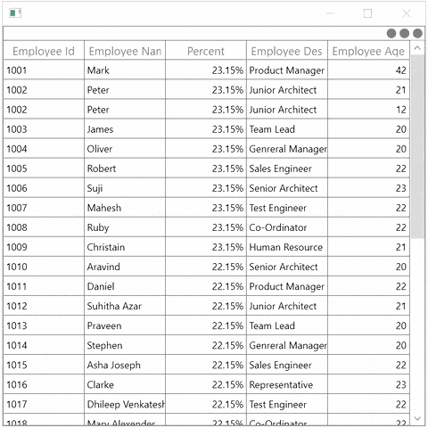

# How to Show the FilterIcon While Mouse Hover in WPF DataGrid?

This sample show cases how to show the FilterIcon while Mouse hover in [WPF DataGrid](https://www.syncfusion.com/wpf-controls/datagrid) (SfDataGrid).

`DataGrid` does not provide the support to set the filter icon visibility based on mouse positions, you can achieve this by customize the [GridDataHeaderCellRenderer](https://help.syncfusion.com/cr/wpf/Syncfusion.UI.Xaml.Grid.Cells.GridDataHeaderCellRenderer.html) and [GridHeaderCellControl](https://help.syncfusion.com/cr/wpf/Syncfusion.UI.Xaml.Grid.GridHeaderCellControl.html).

``` csharp
public class GridDataHeaderCellRendererExt : GridDataHeaderCellRenderer
{
    protected override Syncfusion.UI.Xaml.Grid.GridHeaderCellControl OnCreateEditUIElement()
    {
        return new GridHeaderCellControlExt();
    }

    public override void OnUpdateEditBinding(Syncfusion.UI.Xaml.Grid.DataColumnBase dataColumn, Syncfusion.UI.Xaml.Grid.GridHeaderCellControl element, object dataContext)
    {
        base.OnUpdateEditBinding(dataColumn, element, dataContext);
        element.FilterIconVisiblity = System.Windows.Visibility.Collapsed;
    }
}

public class GridHeaderCellControlExt:GridHeaderCellControl
{
    public GridHeaderCellControlExt() : base()
    {
            
    }

    protected override void OnMouseEnter(System.Windows.Input.MouseEventArgs e)
    {
        base.OnMouseEnter(e);

        if(this.DataGrid.AllowFiltering && Column.AllowFiltering)
            this.FilterIconVisiblity = System.Windows.Visibility.Visible;
        else if(this.DataGrid.AllowFiltering && !Column.AllowFiltering)
            this.FilterIconVisiblity = System.Windows.Visibility.Collapsed;
        else if(!this.DataGrid.AllowFiltering && Column.AllowFiltering)
            this.FilterIconVisiblity = System.Windows.Visibility.Visible;
        else
            this.FilterIconVisiblity = System.Windows.Visibility.Collapsed;
    }

    protected override void OnMouseLeave(System.Windows.Input.MouseEventArgs e)
    {
        base.OnMouseLeave(e);

        if(Column.FilterPredicates.Count!=0)
            this.FilterIconVisiblity = System.Windows.Visibility.Visible;
        else
            this.FilterIconVisiblity = System.Windows.Visibility.Collapsed;
    }
}
```

